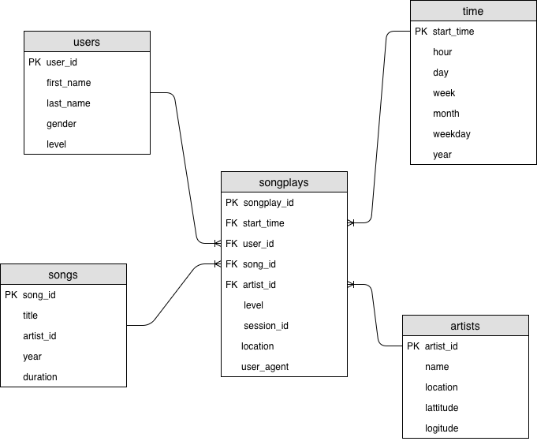

# Data Modeling with Postgres

This is a udacity's data engineer nano-degree project

## About the project

In this project, we setup the ETL pipeline which saves data from raw json to fact and dimension tables in postgreSQL.

The pipeline contains the following processes:

1. Define database tables with dimension and fact structure.
2. Load json data from multiple data sources.
3. Preprocess the raw data in order to meet star schema structure requirements.
4. Insert data to the defined table.

## Contents

`test.ipynb`:  displays the first few rows of each table to let you check your database.

`create_tables.py`: drops and creates tables. You run this file to reset your tables before each time you run your ETL scripts.

`etl.ipynb`: reads and processes a single file from `song_data` and `log_data` and loads the data into your tables. This notebook contains detailed instructions on the ETL process for each of the tables.

`etl.py`:  reads and processes files from `song_data` and `log_data` and loads them into your tables. You can fill this out based on your work in the ETL notebook.

`sql_queries.py`: contains all your sql queries, and is imported into the last three files above.

`README.md`: this document.

`requirements.txt`: dependencies are defined, which is created by `pip freeze` in the project workspace.

`data/*`: raw data for this project. These data are not included in this repository. `Song Dataset` is a subset of the [Million Song Dataset](https://labrosa.ee.columbia.edu/millionsong/). `Log Dataset` is generated by this [event simulator](https://github.com/Interana/eventsim) based on the songs.

## Requirement

This project assumes that you can connect postgreSQL database. If you setup your own database server, you should fix connection parameters which are hard coded in the source codes such as `conn = psycopg2.connect("host=127.0.0.1 dbname=studentdb user=student password=student")`.

The dependencies are defined in `requirements.txt`. In the project's directory, the following command will install required dependencies. 

```
pip3 install pip install -r requirements.txt
```

You should prepare raw data which is described in the Contents section. And put the data under the `data/` directories in the following way.

```
$ tree ./data

data
├── log_data
│   └── 2018
│       └── 11
│           ├── 2018-11-01-events.json
...
│           └── 2018-11-30-events.json
└── song_data
    └── A
        ├── A
        │   ├── A
        │   │   ├── TRAAAAW128F429D538.json
...
        │   │   └── TRAAAVO128F93133D4.json
        │   ├── B
        │   │   ├── TRAABCL128F4286650.json
...
        │   │   └── TRAABYW128F4244559.json
        │   └── C
        │       ├── TRAACCG128F92E8A55.json
...
        │       └── TRAACZK128F4243829.json
        └── B
            ├── A
            │   ├── TRABACN128F425B784.json
...
            │   └── TRABAZH128F930419A.json
            ├── B
            │   ├── TRABBAM128F429D223.json
...
            │   └── TRABBZN12903CD9297.json
            └── C
                ├── TRABCAJ12903CDFCC2.json
...
                └── TRABCYE128F934CE1D.json
```

## Usage

Run the following command `python elt.py`. This script connect the postgreSQL server of localhost and creates some tables (descibed the following section) and insert processed data.

## About Table Schema

### Table Definition

In this project, the following tables are defined.Processed data are stored in a relational database system (PostgreSQL). This database have multiple dimensional table and single fact table. The schema difines the following tables.

#### Fact Table

* songplays - records in log data associated with song plays i.e. records with page NextSong
  - songplay_id
  - start_time
  - user_id
  - level
  - song_id
  - artist_id
  - session_id
  - location
  - user_agent

#### Dimension Tables
* users - users in the app
  - user_id
  - first_name
  - last_name
  - gender
  - level


* songs - songs in music database
  - song_id
  - title
  - artist_id
  - year
  - duration

* artists - artists in music database
  - artist_id
  - name
  - location
  - lattitude
  - longitude

* time - timestamps of records in songplays broken down into specific units
  - start_time
  - hour
  - day
  - week
  - month
  - year
  - weekday

### ER diagram

The table schema can be visualized by using Entity Relational Diagram. The following figure describe the table schema of the project.



